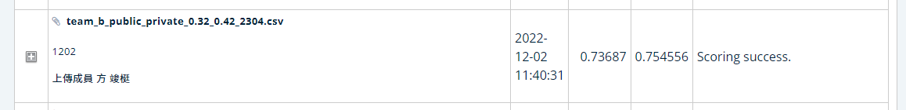

**:hear_no_evil:AICUP2022_無人機飛行載具之智慧計數競賽:hear_no_evil:**
=
[無人機飛行載具之智慧計數競賽](https://tbrain.trendmicro.com.tw/Competitions/Details/25)
-

**指導教授: 劉宗榮**

**隊伍名稱:Team_2059**

**隊長:陳語嫣，組員:方峻梃、廖浩翔、謝東格、張祐嘉**

**Paper - [YOLOv7: Trainable bag-of-freebies sets new state-of-the-art for real-time object detectors](https://arxiv.org/abs/2207.02696)**


**整體流程**
-

```
Training
├── runs
│   ├── train               存放訓練權重資料夾
│   ├── detect              存放 public 跟 private 輸出資料夾 
│   └── save                存放 public 跟 private .csv 輸出資料夾 
│
├── make_txt.py             把主辦單位給的csv轉成相關格式
├── Target data set
│   ├── train.txt           轉檔後的訓練標籤檔
│   ├── val.txt             轉檔後的驗證標籤檔 
│   ├── train               存放 train 的 image 跟 labels 資料夾
│   └── save                存放 val 的 image 跟 labels 資料夾
├── train.py                執行訓練及其他參數調整
├── runs
│   ├── train               存放訓練權重資料夾
│   ├── detect              存放 public跟private 的輸出 
│   └── save                存放 public跟private .csv 的輸出 
├── data_arg
│   ├── Ensemble            不同模型跟csv結合
│   ├── Augmentation        資料擴增、翻轉、旋轉     
│   
├── log                     訓練loss可視化(tensorboard)
├── wandb                   訓練loss可視化(wandb)
├── yolov7.pt               YOLOv7 預訓練模型
├── yolov7_w6.pt            YOLOv7_w6 預訓練模型  

Testing
├── detect.py               輸出 public 跟 private 資料集
├── csv_output.py           將 public 跟 private 資料集結果轉為.csv  

```


**Installation Environment**
-
   ```
   打在這


  
 ```


**Training**
-
1. 準備Ground truth label (train.txt跟val.txt)並將訓練圖片放入training資料夾，格式如下
   ```
    D:/Aicup_drone/image_path/train/images/img10001.jpg
    D:/Aicup_drone/image_path/train/images/img10002.jpg
    D:/Aicup_drone/image_path/train/images/img10003.jpg
    D:/Aicup_drone/image_path/train/images/img10004.jpg
    ...
   ```


2.相關參數

    epochs: 80
    batch_size: 3
    img_size:2048x2048
    learning rate:0.01
     打這
 
 

 
 
 

 
**最高分數**
-

  


**Reference**
-
   **Paper - [YOLOv7: Trainable bag-of-freebies sets new state-of-the-art for real-time object detectors](https://arxiv.org/abs/2207.02696)**


